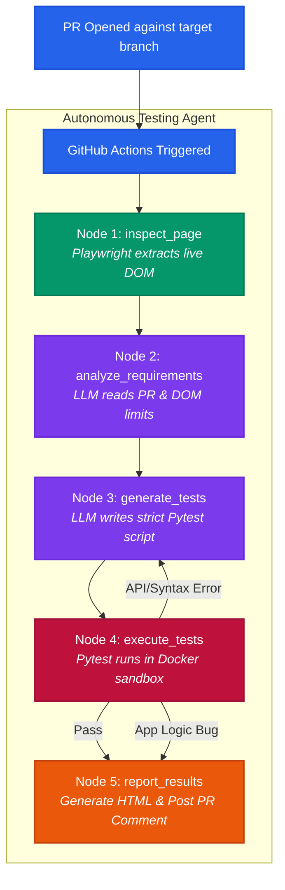

# Autonomous AI Testing Agent 🤖

An **Autonomous AI Testing Agent** that integrates directly into your GitHub CI/CD pipeline to act as a tireless QA Engineer. When a Pull Request is opened, this agent automatically reads the proposed changes, inspects the live application, writes end-to-end tests, executes them in a sandboxed environment, and reports the results back to the PR.

### 🌟 Core Value Proposition

This agent bridges the gap between development and QA by ensuring every PR is automatically tested against real-world browser conditions _before_ merging.

Unlike traditional static tests, this agent:

- **Validates Intent**: It reads the PR description to understand _why_ a change was made, not just _what_ code changed.
- **Adapts to UI Changes**: It dynamically inspects the live DOM (via Playwright) to extract accurate element selectors, eliminating brittle test maintenance.
- **Maintains Strict QA Standards**: It acts as an **oracle of truth**. If a developer introduces a logic bug (e.g., a valid promo code incorrectly shows an "Invalid" message), the AI recognizes that the _application_ is broken, not the test. It intentionally fails the test to block the PR, rather than weakening its assertions to achieve a passing grade.

### 🎯 Key Use Cases

- **Automated Regression Testing:** Catch UI and logic regressions on legacy applications without writing thousands of lines of brittle Selenium scripts.
- **Rapid Prototyping QA:** Ensure MVP features work as intended immediately upon PR creation, without waiting for a manual QA cycle.
- **Developer Productivity:** Free up engineers from writing boilerplate E2E tests for simple UI components, allowing them to focus on complex backend logic.
- **CI/CD Quality Gates:** Strictly block faulty code from entering the `main` branch with autonomous, reliable pass/fail metrics.

---

## Architecture & Workflow

The agent is built as a state machine using **LangGraph**, progressing through a strict 5-node pipeline for every PR.



**Technology Stack:**

- **Orchestration:** Python, LangGraph (ReAct State Machine)
- **Primary LLM:** `Llama 3 70B` (via LangChain-Groq for ultra-fast, high-reasoning inference)
- **Fallback LLM:** `Ollama` (local open-source fallback for high-availability)
- **Browser Automation:** Playwright
- **Testing Framework:** Pytest
- **Infrastructure:** Docker, GitHub Actions CI/CD
- **Integration:** PyGithub (Automated PR commenting and Artifact Commit)

---

## Quick Start (Local Development)

### Prerequisites

- Python 3.10+
- Node.js (for `npx serve`, optional)
- A Groq API key (free at [console.groq.com](https://console.groq.com))

### 1. Install dependencies

```bash
pip install -r requirements.txt
playwright install chromium
```

### 2. Set environment variables

```bash
# Create a .env file (already gitignored)
echo "GROQ_API_KEY=your_groq_api_key_here" > .env
```

### 3. Start the target demo app

```bash
# In one terminal:
python -m http.server 8080 --directory app
```

### 4. Run the agent

```bash
# In another terminal:
python src/agent.py
```

**Expected output:**

```
[Agent] Starting in Local Dev Mode
[Agent] Step 1/4 — Inspecting live page at http://localhost:8080 ...
--- DOM INSPECTION REPORT ---
Page Title: Simple Target Application
Form Fields:
  <input type="email" id="email" ...> [REQUIRED]
  <input type="text" id="cardNumber" ...> [REQUIRED]
Buttons:
  <button id="submitOrderBtn">: "Submit Order"
Feedback / Message Elements:
  id="successMsg": "Order processed successfully!"
  id="errorMsg": "Please fill out all fields."
--- END DOM INSPECTION REPORT ---

[Agent] Step 2/4 — Analyzing PR requirements ...
[Agent] Step 3/4 — Generating test script (Attempt 1) ...
[Agent] Step 4/4 — Executing test script (Attempt 1) ...
...
```

---

## CI/CD Setup (GitHub Actions)

### 1. Add your Groq API key as a secret

Go to your repo → **Settings → Secrets and variables → Actions → New repository secret**

- Name: `GROQ_API_KEY`
- Value: your Groq API key

> **Note:** `GITHUB_TOKEN` is automatically provided by GitHub Actions — no setup needed.

### 2. The workflow triggers automatically

Every time a PR is opened or updated, the `ai-qa` job runs and posts a detailed PR comment:

> **🤖 Autonomous AI Testing Agent Report**
>
> **PR #4** | **Status: ❌ FAILED** | **Attempts: 1**
>
> | Metric       | Value                   |
> | ------------ | ----------------------- |
> | Target URL   | `http://localhost:8080` |
> | Tests Passed | ✅ 2                    |
> | Tests Failed | ❌ 4                    |
>
> ### 📊 Per-Test Results
>
> | Test                             | Result    |
> | -------------------------------- | --------- |
> | Valid Promo Code Entry           | ❌ FAILED |
> | Multiple Promo Code Applications | ✅ PASSED |

### 3. Beautiful HTML Reports Auto-Saved

After each run, a custom-built, dependency-free Python HTML generator creates a stunning dark-theme report.
The GitHub Action automatically **commits this report directly to your branch** (e.g., `artifact-generated-for-test-PR/report-pr-4.html`) and uploads it as an artifact.

**Report Features:**

- Overall Pass/Fail metrics and duration
- A visual progress bar
- Expandable cards for each test showing:
  - **Intent**: The exact PR requirement the test is validating
  - **Failure Trace**: Clean, color-coded assertion logs if the test failed

---

## Project Structure

```
ai-testing-agent/
├── .github/
│   └── workflows/
│       └── ai-qa.yml           # GitHub Actions CI workflow
├── app/
│   └── index.html              # Demo target application (checkout form)
├── artifact-results/           # Sample outputs from a real CI run
│   ├── test_generated.py       # Example generated test script
│   ├── report.html             # Example HTML test report
│   ├── conftest.py             # Pytest report customization
│   └── pytest.ini              # Pytest configuration
├── src/
│   ├── agent.py                # Main LangGraph agent (4 nodes + routing)
│   └── tools/
│       └── page_inspector.py   # Playwright DOM scraper tool
├── Dockerfile                  # Agent container definition
├── requirements.txt            # Python dependencies
└── README.md
```

---

## How the Agent Self-Heals (and Why It's Trustworthy)

The agent distinguishes between two types of failures:

| Failure Type                                                  | Agent Action                                                |
| ------------------------------------------------------------- | ----------------------------------------------------------- |
| **Python/API Error** (e.g. wrong Playwright syntax, timeout)  | Rewrites the code based on the error trace, preserves goals |
| **Assertion Failure** (App behaves differently than expected) | Retains the strict assertion — exposes the application bug  |

By providing strict LLM Prompts, the agent acts as an **oracle of truth**. If a developer introduces a backwards logic bug (e.g., applying a promo code saves $0), the AI will generate a test expecting $10. When the test fails, instead of making the test look for $0 to pass, it strictly halts and reports the failure to the PR.

---

## Environment Variables

| Variable            | Required  | Description                                      |
| ------------------- | --------- | ------------------------------------------------ |
| `GROQ_API_KEY`      | ✅ Always | Groq LLM API key                                 |
| `GITHUB_TOKEN`      | CI only   | Auto-provided by GitHub Actions                  |
| `GITHUB_REPOSITORY` | CI only   | Auto-provided (`owner/repo`)                     |
| `WORKSPACE_DIR`     | CI only   | Directory for test artifacts (default: temp dir) |
